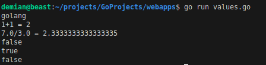
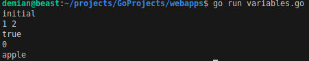
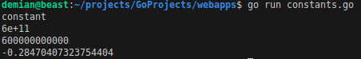
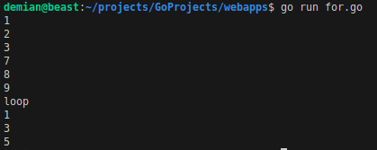

**Go by Example**


# Go by Example 

## Introduction

✍️ In this installment I will continue working through the content on Go.dev site. I plan to work through all of the Go by Example Programming Examples. Then I'll move to the sites other content.

## Prerequisite

✍️ Have Golang installed


## Hello World

✍️ The first example is the obligatory Hello World. We'll call the file helloworld.go

### Step 1 — Registering a Request Handler

An http.ResponseWriter which is where you write your text/html response to.
An http.Request which contains all information about this HTTP request including things like the URL or header fields.

```
http.HandleFunc("/", func (w http.ResponseWriter, r *http.Request) {
    fmt.Fprintf(w, "Hello, you've requested: %s\n", r.URL.Path)
})
```

### Step 2 — Listen for HTTP Connections

The request handler alone can not accept any HTTP connections from the outside. An HTTP server has to listen on a port to pass connections on to the request handler. Because port 80 is in most cases the default port for HTTP traffic, this server will also listen on it.

The following code will start Go’s default HTTP server and listen for connections on port 80. You can navigate your browser to http://localhost/ and see your server handing your request.

```
http.ListenAndServe(":8090", nil)
```

### Step 3 — Completed Code

```
package main

import (
    "fmt"
    "net/http"
)

func main() {
    http.HandleFunc("/", func(w http.ResponseWriter, r *http.Request) {
        fmt.Fprintf(w, "Hello, you've requested: %s\n", r.URL.Path)
    })

    http.ListenAndServe(":8090", nil)
}
```

### Step 4 — Test the code

run 
```
go run helloworld.go &

```
test it out
```
curl localhost:8090/hello
```
you should get a message saying:
_Hello, you've requested: \hello_

or something like that


### Step 5 — Notes
The coding example used port 80. I have other software trying to use that port so I changed it 8090. You may need to do the same. 


---

## Values
<div style="border: 2px solid #000;"></div>


### Step 1 — Back to Basics
I'm not going to spend to much time on this, but I have to know the basics. So this example shows the different value types and boolean expressions.

```
package main

import "fmt"

func main() {

    fmt.Println("go" + "lang")

    fmt.Println("1+1 =", 1+1)
    fmt.Println("7.0/3.0 =", 7.0/3.0)

    fmt.Println(true && false)
    fmt.Println(true || false)
    fmt.Println(!true)
}
```
### Step 2 - Output



---
## Variables
### Step1 - Declaring Variables
There are some important things to point out here:
- var declares 1 or more variables.
- You can declare multiple variables at once.
- Go will infer the type of initialized
- Variables declared without a corresponding initialization are zero-valued. For example, the zero value for an int is 0.
- The := syntax is shorthand for declaring and initializing a variable, e.g. for var f string = "apple" in this case. This syntax is only available inside functions.

```
package main

import "fmt"

func main() {

    var a = "initial"
    fmt.Println(a)

    var b, c int = 1, 2
    fmt.Println(b, c)

    var d = true
    fmt.Println(d)

    var e int
    fmt.Println(e)

    f := "apple"
    fmt.Println(f)
}
```



___
## Constants
### Step 1 - Constants

- Go supports constants of character, string, boolean, and numeric values.
- const declares a constant value.
- A const statement can appear anywhere a var statement can.
- Constant expressions perform arithmetic with arbitrary precision.
- A numeric constant has no type until it’s given one, such as by an explicit conversion.A number can be given a type by using it in a context that requires one, such as a variable assignment or function call. For example, here math.Sin expects a float64.

```
package main

import (
    "fmt"
    "math"
)

const s string = "constant"

func main() {
    fmt.Println(s)

    const n = 500000000

    const d = 3e20 / n
    fmt.Println(d)

    fmt.Println(int64(d))

    fmt.Println(math.Sin(n))
}
```


___
## For Loop
### Step 1 - For Loop
for is Go’s only looping construct. REPEAT Only! No while loops, no do while, thats it. Here are some basic types of for loops. 
- The most basic type, with a single condition. 
- A classic initial/condition/after for loop.
- for without a condition will loop repeatedly until you break out of the loop or return from the enclosing function.
- You can also continue to the next iteration of the loop.

```
package main

import "fmt"

func main() {

    i := 1
    for i <= 3 {
        fmt.Println(i)
        i = i + 1
    }

    for j := 7; j <= 9; j++ {
        fmt.Println(j)
    }

    for {
        fmt.Println("loop")
        break
    }

    for n := 0; n <= 5; n++ {
        if n%2 == 0 {
            continue
        }
        fmt.Println(n)
    }
}
```


## ☁️ Outcome

✍️ This was a good session focusing on the basics. You can't escape them.

## Next Steps

✍️ Continue with more examples

## Social Proof

[toot](https://mastodon.social/@code_sentinel/111104169831228646)
